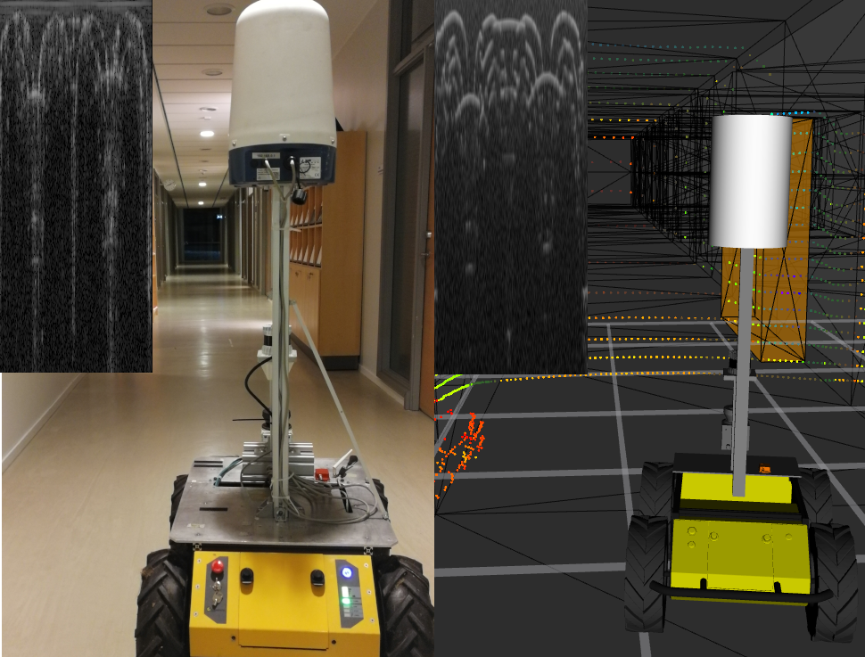

# RadaRays




RadaRays allows for the accurate modeling and simulation of rotating FMCW radar sensors in complex environments, including the simulation of reflection, refraction, and scattering of radar waves. Our software is able to handle large numbers of objects and materials in real-time, making it suitable for use in a variety of mobile robotics applications. We demonstrate the effectiveness of RadaRays through a series of experiments and show that it can more accurately reproduce the behavior of FMCW radar sensors in a variety of environments, compared to the ray casting-based lidar-like simulations that are commonly used in simulators for autonomous driving such as CARLA. Our experiments additionally serve as a valuable reference point for researchers to evaluate their own radar simulations. By using RadaRays, developers can significantly reduce the time and cost associated with prototyping and testing FMCW radar-based algorithms. We also provide a Gazebo plugin that makes our work accessible to the mobile robotics community.

```bib
@article{mock2025radarays,
  author={Mock, Alexander and Magnusson, Martin and Hertzberg, Joachim},
  journal={IEEE Robotics and Automation Letters}, 
  title={{RadaRays}: Real-Time Simulation of Rotating FMCW Radar for Mobile Robotics via Hardware-Accelerated Ray Tracing}, 
  year={2025},
  volume={10},
  number={3},
  pages={2470-2477},
  doi={10.1109/LRA.2025.3531689}
}
```

The paper is available on [IEEE Xplore](https://ieeexplore.ieee.org/abstract/document/10845807) and as preprint on [arXiv](https://arxiv.org/abs/2310.03505).

## Code Repositories
- Library + Experiments: https://github.com/uos/radarays_ros
- Gazebo Plugin: https://github.com/uos/radarays_gazebo_plugins
